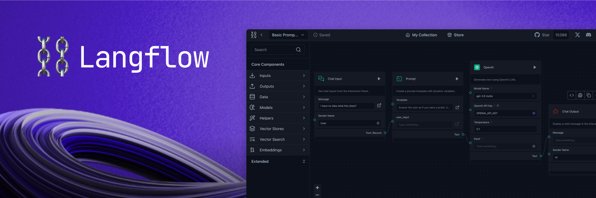

<div align="center" style="padding: 10px; border: 1px solid #ccc; background-color: #f9f9f9; border-radius: 10px; margin-bottom: 20px;">
    <h2 style="margin: 0; font-size: 24px; color: #333;">Langflow 1.0 is OUT! 🎉</h2>
    <p style="margin: 5px 0 0 0; font-size: 16px; color: #666;">Read all about it <a href="https://medium.com/p/73d3bdce8440" style="text-decoration: underline; color: #1a73e8;">here</a>!</p>
</div>

<!-- markdownlint-disable MD030 -->

# [](https://www.langflow.org)

<p align="center"><strong>
    A visual framework for building multi-agent and RAG applications
</strong></p>
<p align="center" style="font-size: 12px;">
    Open-source, Python-powered, fully customizable, LLM and vector store agnostic
</p>

<p align="center">
  
</p>

# 📝 Content

- [](#)
- [📝 Content](#-content)
- [📦 Get Started](#-get-started)
- [🎨 Create Flows](#-create-flows)
- [Deploy](#deploy)
  - [Deploy Langflow on Google Cloud Platform](#deploy-langflow-on-google-cloud-platform)
  - [Deploy on Railway](#deploy-on-railway)
  - [Deploy on Render](#deploy-on-render)
  - [Deploy on Kubernetes](#deploy-on-kubernetes)
- [🖥️ Command Line Interface (CLI)](#️-command-line-interface-cli)
  - [Usage](#usage)
    - [Environment Variables](#environment-variables)
- [👋 Contribute](#-contribute)
- [🌟 Contributors](#-contributors)
- [📄 License](#-license)

# 📦 Get Started

You can install Langflow with pip:

```shell
# Make sure you have >=Python 3.10 installed on your system.
python -m pip install langflow -U
```

Then, run Langflow with:

```shell
python -m langflow run
```

You can also preview Langflow in [HuggingFace Spaces](https://huggingface.co/spaces/Langflow/Langflow-Preview). [Clone the space using this link](https://huggingface.co/spaces/Langflow/Langflow-Preview?duplicate=true) to create your own Langflow workspace in minutes.

# 🎨 Create Flows

Creating flows with Langflow is easy. Simply drag components from the sidebar onto the workspace and connect them to start building your application.

Explore by editing prompt parameters, grouping components into a single high-level component, and building your own Custom Components.

Once you’re done, you can export your flow as a JSON file.

Load the flow with:

```python
from langflow.load import run_flow_from_json

results = run_flow_from_json("path/to/flow.json", input_value="Hello, World!")
```

# Deploy

You can run the Langflow using the following command:

```shell
langflow run [OPTIONS]
```

Each option is detailed below:

- `--help`: Displays all available options.
- `--host`: Defines the host to bind the server to. Can be set using the `LANGFLOW_HOST` environment variable. The default is `127.0.0.1`.
- `--workers`: Sets the number of worker processes. Can be set using the `LANGFLOW_WORKERS` environment variable. The default is `1`.
- `--timeout`: Sets the worker timeout in seconds. The default is `60`.
- `--port`: Sets the port to listen on. Can be set using the `LANGFLOW_PORT` environment variable. The default is `7860`.
- `--env-file`: Specifies the path to the .env file containing environment variables. The default is `.env`.
- `--log-level`: Defines the logging level. Can be set using the `LANGFLOW_LOG_LEVEL` environment variable. The default is `critical`.
- `--components-path`: Specifies the path to the directory containing custom components. Can be set using the `LANGFLOW_COMPONENTS_PATH` environment variable. The default is `langflow/components`.
- `--log-file`: Specifies the path to the log file. Can be set using the `LANGFLOW_LOG_FILE` environment variable. The default is `logs/langflow.log`.
- `--cache`: Selects the type of cache to use. Options are `InMemoryCache` and `SQLiteCache`. Can be set using the `LANGFLOW_LANGCHAIN_CACHE` environment variable. The default is `SQLiteCache`.
- `--dev/--no-dev`: Toggles the development mode. The default is `no-dev`.
- `--path`: Specifies the path to the frontend directory containing build files. This option is for development purposes only. Can be set using the `LANGFLOW_FRONTEND_PATH` environment variable.
- `--open-browser/--no-open-browser`: Toggles the option to open the browser after starting the server. Can be set using the `LANGFLOW_OPEN_BROWSER` environment variable. The default is `open-browser`.
- `--remove-api-keys/--no-remove-api-keys`: Toggles the option to remove API keys from the projects saved in the database. Can be set using the `LANGFLOW_REMOVE_API_KEYS` environment variable. The default is `no-remove-api-keys`.
- `--install-completion [bash|zsh|fish|powershell|pwsh]`: Installs completion for the specified shell.
- `--show-completion [bash|zsh|fish|powershell|pwsh]`: Shows completion for the specified shell, allowing you to copy it or customize the installation.
- `--backend-only`: This parameter, with a default value of `False`, allows running only the backend server without the frontend. It can also be set using the `LANGFLOW_BACKEND_ONLY` environment variable.
- `--store`: This parameter, with a default value of `True`, enables the store features, use `--no-store` to deactivate it. It can be configured using the `LANGFLOW_STORE` environment variable.

These parameters are important for users who need to customize the behavior of Langflow, especially in development or specialized deployment scenarios.

### Environment Variables

You can configure many of the CLI options using environment variables. These can be exported in your operating system or added to a `.env` file and loaded using the `--env-file` option.

A sample `.env` file named `.env.example` is included with the project. Copy this file to a new file named `.env` and replace the example values with your actual settings. If you're setting values in both your OS and the `.env` file, the `.env` settings will take precedence.

# 👋 Contribute

We welcome contributions from developers of all levels to our open-source project on GitHub. If you'd like to contribute, please check our [contributing guidelines](./CONTRIBUTING.md) and help make Langflow more accessible.